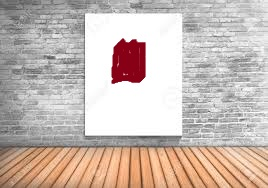
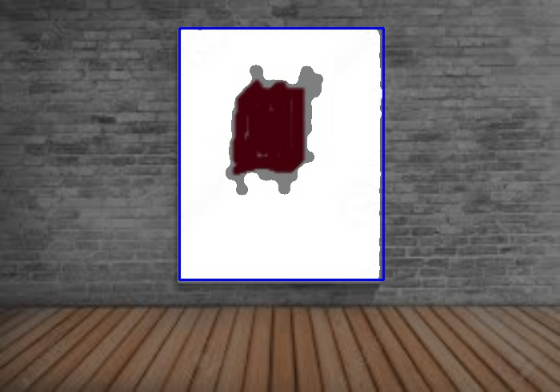

# Object-detection
Detect objects like rectangle, circle, ball specified color

Script to choose the value of HSV Color range >>> #hsv_range_selector.py

detected outer rectangle in rectangle.jpg     >>> #rectangle_detection.py 

detect innner rectangle in rectangle.jpg      >>> #rectangle_detection2.py 
 
 rectangle.jpg, all the output of each step is in data folder
 
 Input Image
 
 
 
 

 
 
 
 
 
 
 
 
 ENJOY processing 
